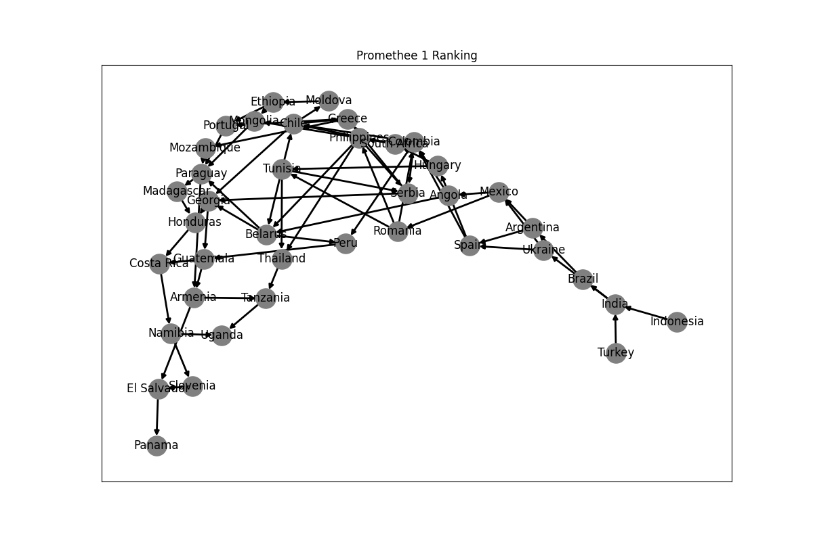

# 3.1:

| Question                                                                                                                                                                                                                                                                                                                                                        | Answer                                                                                                                                                                                                                  |
| --------------------------------------------------------------------------------------------------------------------------------------------------------------------------------------------------------------------------------------------------------------------------------------------------------------------------------------------------------------- | ----------------------------------------------------------------------------------------------------------------------------------------------------------------------------------------------------------------------- |
| What is the domain of the problem about?                                                                                                                                                                                                                                                                                                                        | The domain of the problem is about economic indicators of different countries.                                                                                                                                          |
| What is the source of the data?                                                                                                                                                                                                                                                                                                                                 | [github](https://github.com/Valdecy/Datasets/blob/master/MCDA/MCDA-01-ECI%202019.txt)                                                                                                                                   |
| What is the point of view of the decision maker?                                                                                                                                                                                                                                                                                                                | The point of view of the decision maker is not specified in the question.                                                                                                                                               |
| What is the number of alternatives considered? Were there more of them in the original data set?                                                                                                                                                                                                                                                                | The number of alternatives considered is equal to the number of countries in the dataset (**36**). There were more in the original dataset.                                                                             |
| Describe one of the alternatives considered (give its name, evaluations, specify preferences for this alternative)                                                                                                                                                                                                                                              | One of the alternatives considered is Angola: (Gross Domestic Product: 198.8652, Unemployment Rate: 0.136317784, Income Tax Rate: 18.6, Inflation: 0.040629596, Total Reserves: 17330953410.0, GINI: 51.3)              |
| What is the number of criteria considered? Were there more of them in the original data set?                                                                                                                                                                                                                                                                    | The number of criteria considered is six (Gross Domestic Product, Unemployment Rate, Income Tax Rate, Inflation, Total Reserves, GINI). There were more in the original dataset.                                        |
| What is the origin of the various criteria? (catalog parameter / created by the decision maker - how?)                                                                                                                                                                                                                                                          | ???                                                                                                                                                                                                                     |
| What are the domains of the individual criteria (discrete / continuous)? Note: in the case of continuous domains, specify the range of the criterion’s variability, in the case of others: list the values. What is the nature (gain / cost) of the individual criteria?                                                                                        | All criterions are continuous type. `Unemployment Rate` and `Inflation` are in range [0, 1], `Income Tax Rate` and `GINI` are in range [0, 100] and finally `Gross Domestic Product` and `Total Reserves` are unbounded |
| Are all criteria of equal importance (should they have the same ”weights”)? If not, can the relative importance of the criteria under consideration be expressed in terms of weights? In this case, estimate the weights of each criterion on a scale of 1 to 10. Are there any criteria among the criteria that are completely or almost invalid / irrelevant? | The importance and weights of the criteria are not specified in the question.                                                                                                                                           |
| Are there dominated alternatives among the considered data set? If so, present all of them (dominating and dominated alternative), giving their names and values on the individual criteria.                                                                                                                                                                    | ???                                                                                                                                                                                                                     |
| What should the theoretically best alternative look like in your opinion? Is it a small advantage on many criteria, or rather a strong advantage on few (but key) criteria? Which?                                                                                                                                                                              | ???                                                                                                                                                                                                                     |
| Which of the considered alternatives (provide name and values on individual criteria) seems to be the best / definitely better than the others? Is it determined by one reason (e.g. definitely the lowest price) or rather the overall value of the criteria? Does this alternative still have any weaknesses?                                                 | ???                                                                                                                                                                                                                     |
| Which of the considered alternatives (provide name and values on individual criteria) seems to be the worst / definitely worse than the others? Is it determined by one reason (e.g. definitely the highest price), or rather the overall value of the criteria? Does this alternative still have any strengths?                                                | Uganda                                                                                                                                                                                                                  |

# 3.2

Write the preferential information you provided at the input of the method:

```python
parameters = {
    "Gross Domestic Product": {"type": "gain", "q": 100, "p": 1000, "weight": 1},
    "Unemployment Rate": {"type": "cost", "q": 0.1, "p": 0.2, "weight": 1},
    "Income Tax Rate": {"type": "cost", "q": 1, "p": 1, "weight": 1},
    "Inflation": {"type": "cost", "q": 0, "p": 0.1, "weight": 1},
    "Total Reserves": {"type": "gain", "q": 1, "p": 1000, "weight": 1},
    "GINI": {"type": "cost", "q": 1, "p": 1, "weight": 1},
}
```

## Promethee1 and Promethee2 results:




