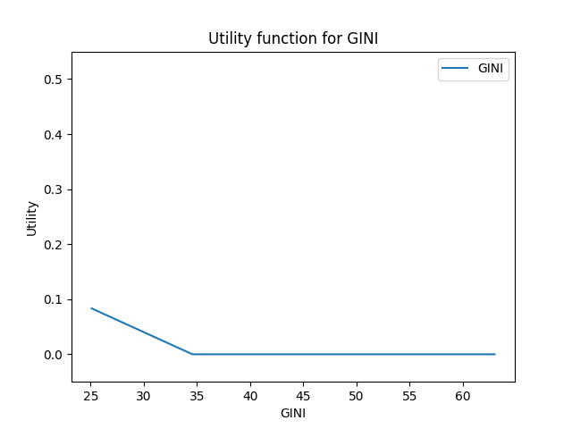
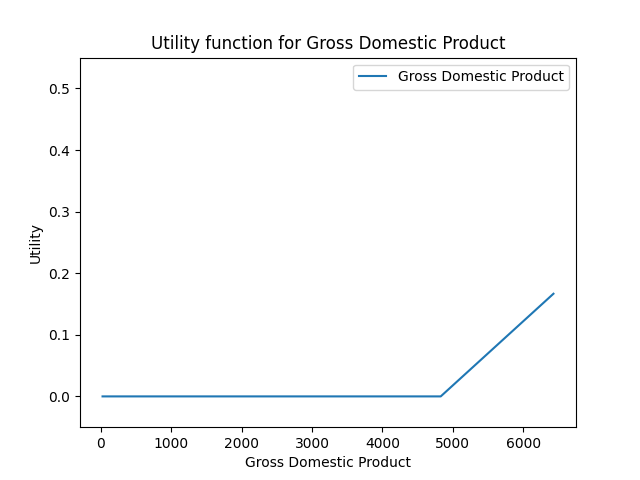
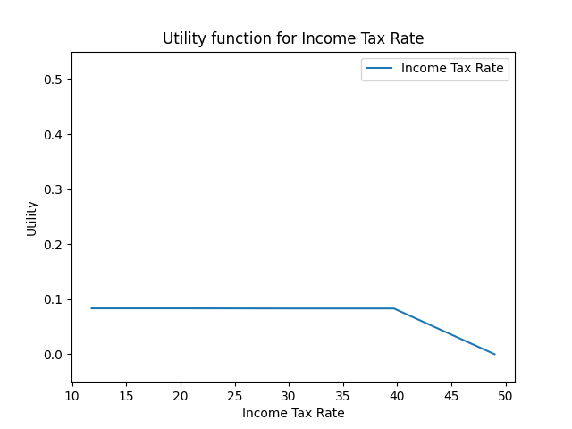
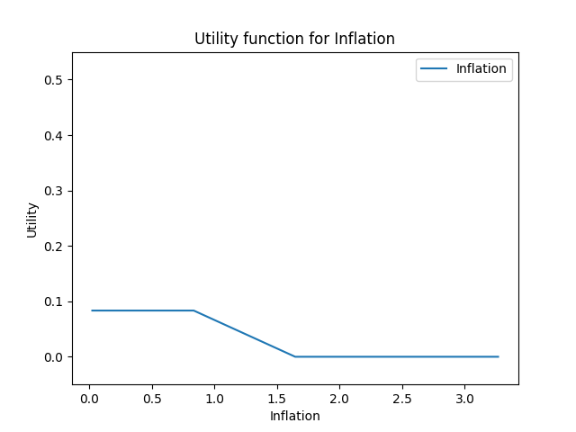
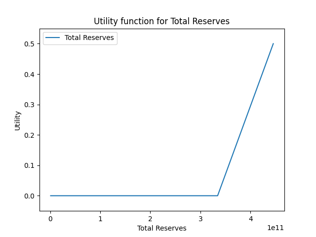
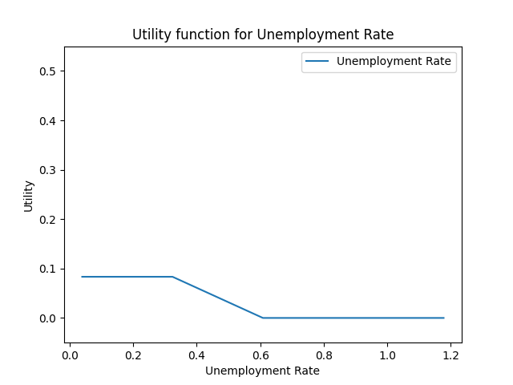

# 2.1:

    done:)

# 2.2:

```
MINIMIZE
1*Argentina_P_Guatemala + 1*Colombia_P_Argentina + 1*Colombia_P_Serbia + 1*Greece_P_Colombia + 1*Guatemala_P_Colombia + 1*Serbia_P_Greece + 0
SUBJECT TO
_C1: Gross_Domestic_Product_26.57 = 0

_C2: Gross_Domestic_Product_6427.67 <= 0.5

_C3: Gross_Domestic_Product_6427.67 >= 0.0833333333333

_C4: Gross_Domestic_Product_1626.84 - Gross_Domestic_Product_26.57 >= 0

_C5: - Gross_Domestic_Product_1626.84 + Gross_Domestic_Product_3227.12 >= 0

_C6: - Gross_Domestic_Product_3227.12 + Gross_Domestic_Product_4827.39 >= 0

_C7: - Gross_Domestic_Product_4827.39 + Gross_Domestic_Product_6427.67 >= 0

_C8: Unemployment_Rate_1.18 = 0

_C9: Unemployment_Rate_0.04 <= 0.5

_C10: Unemployment_Rate_0.04 >= 0.0833333333333

_C11: Unemployment_Rate_0.04 - Unemployment_Rate_0.32 >= 0

_C12: Unemployment_Rate_0.32 - Unemployment_Rate_0.61 >= 0

_C13: Unemployment_Rate_0.61 - Unemployment_Rate_0.89 >= 0

_C14: Unemployment_Rate_0.89 - Unemployment_Rate_1.18 >= 0

_C15: Income_Tax_Rate_49.00 = 0

_C16: Income_Tax_Rate_11.80 <= 0.5

_C17: Income_Tax_Rate_11.80 >= 0.0833333333333

_C18: Income_Tax_Rate_11.80 - Income_Tax_Rate_21.10 >= 0

_C19: Income_Tax_Rate_21.10 - Income_Tax_Rate_30.40 >= 0

_C20: Income_Tax_Rate_30.40 - Income_Tax_Rate_39.70 >= 0

_C21: Income_Tax_Rate_39.70 - Income_Tax_Rate_49.00 >= 0

_C22: Inflation_3.27 = 0

_C23: Inflation_0.02 <= 0.5

_C24: Inflation_0.02 >= 0.0833333333333

_C25: Inflation_0.02 - Inflation_0.83 >= 0

_C26: Inflation_0.83 - Inflation_1.64 >= 0

_C27: Inflation_1.64 - Inflation_2.46 >= 0

_C28: Inflation_2.46 - Inflation_3.27 >= 0

_C29: Total_Reserves_978295594.10 = 0

_C30: Total_Reserves_445435000000.00 <= 0.5

_C31: Total_Reserves_445435000000.00 >= 0.0833333333333

_C32: Total_Reserves_112092471695.58 - Total_Reserves_978295594.10 >= 0

_C33: - Total_Reserves_112092471695.58 + Total_Reserves_223206647797.05 >= 0

_C34: - Total_Reserves_223206647797.05 + Total_Reserves_334320823898.53 >= 0

_C35: - Total_Reserves_334320823898.53 + Total_Reserves_445435000000.00 >= 0

_C36: GINI_63.00 = 0

_C37: GINI_25.09 <= 0.5

_C38: GINI_25.09 >= 0.0833333333333

_C39: GINI_25.09 - GINI_34.57 >= 0

_C40: GINI_34.57 - GINI_44.04 >= 0

_C41: GINI_44.04 - GINI_53.52 >= 0

_C42: GINI_53.52 - GINI_63.00 >= 0

_C43: GINI_25.09 + Gross_Domestic_Product_6427.67 + Income_Tax_Rate_11.80
 + Inflation_0.02 + Total_Reserves_445435000000.00 + Unemployment_Rate_0.04
 = 1

_C44: Colombia_P_Serbia - 0.625879249784 GINI_34.57
 - 0.197684642327 GINI_44.04 + 0.823563892111 GINI_53.52
 + 0.335100851519 Gross_Domestic_Product_1626.84
 - 0.335100851519 Gross_Domestic_Product_26.57
 - 0.827956989247 Income_Tax_Rate_11.80 - 0.172043010753 Income_Tax_Rate_21.10
 + 0.333333333333 Income_Tax_Rate_30.40 + 0.666666666667 Income_Tax_Rate_39.70
 + 0.563798425461 Inflation_0.02 - 0.563798425461 Inflation_0.83
 + 0.333411362112 Total_Reserves_112092471695.58
 - 0.333411362112 Total_Reserves_978295594.10
 - 0.00491547936211 Unemployment_Rate_0.04
 + 0.00491547936211 Unemployment_Rate_0.32 >= 1e-06

_C45: - 0.33543376355 GINI_34.57 + 0.33543376355 GINI_44.04
 - 0.00233422256544 Gross_Domestic_Product_1626.84
 + 0.00233422256544 Gross_Domestic_Product_26.57
 + 0.827956989247 Income_Tax_Rate_11.80 + 0.172043010753 Income_Tax_Rate_21.10
 - 0.698924731183 Income_Tax_Rate_30.40 - 0.301075268817 Income_Tax_Rate_39.70
 - 0.047274048863 Inflation_0.02 + 0.047274048863 Inflation_0.83
 + Serbia_P_Greece + 0.0439888766627 Total_Reserves_112092471695.58
 - 0.0439888766627 Total_Reserves_978295594.10
 - 0.0568748600908 Unemployment_Rate_0.04
 + 0.0568748600908 Unemployment_Rate_0.32 >= 1e-06

_C46: 0.961313013334 GINI_34.57 - 0.137749121223 GINI_44.04
 - 0.823563892111 GINI_53.52 + Greece_P_Colombia
 - 0.332766628953 Gross_Domestic_Product_1626.84
 + 0.332766628953 Gross_Domestic_Product_26.57
 + 0.365591397849 Income_Tax_Rate_30.40 - 0.365591397849 Income_Tax_Rate_39.70
 - 0.516524376598 Inflation_0.02 + 0.516524376598 Inflation_0.83
 - 0.377400238775 Total_Reserves_112092471695.58
 + 0.377400238775 Total_Reserves_978295594.10
 + 0.0617903394529 Unemployment_Rate_0.04
 - 0.0617903394529 Unemployment_Rate_0.32 >= 1e-06

_C47: Colombia_P_Argentina - 0.239155920113 GINI_34.57
 - 0.584407971998 GINI_44.04 + 0.823563892111 GINI_53.52
 - 0.106979930991 Gross_Domestic_Product_1626.84
 + 0.106979930991 Gross_Domestic_Product_26.57
 - 0.172043010753 Income_Tax_Rate_30.40 + 0.172043010753 Income_Tax_Rate_39.70
 - 0.263580914806 Inflation_0.02 + 0.263580914806 Inflation_0.83
 + 0.0145975187137 Total_Reserves_112092471695.58
 - 0.0145975187137 Total_Reserves_978295594.10
 + 0.0486496898959 Unemployment_Rate_0.04
 - 0.0486496898959 Unemployment_Rate_0.32 >= 1e-06

_C48: Argentina_P_Guatemala + 0.239155920113 GINI_34.57
 + 0.209847596841 GINI_44.04 - 0.449003516953 GINI_53.52
 + 0.52306369555 Gross_Domestic_Product_1626.84
 - 0.52306369555 Gross_Domestic_Product_26.57
 - 0.0645161290323 Income_Tax_Rate_21.10
 - 0.430107526882 Income_Tax_Rate_30.40 + 0.494623655914 Income_Tax_Rate_39.70
 + 0.183628891393 Inflation_0.02 - 0.183628891393 Inflation_0.83
 + 0.319466468631 Total_Reserves_112092471695.58
 - 0.319466468631 Total_Reserves_978295594.10
 + 0.56830187205 Unemployment_Rate_0.04 - 0.56830187205 Unemployment_Rate_0.32
 >= 1e-06

_C49: 0.374560375158 GINI_44.04 - 0.374560375158 GINI_53.52
 - 0.416083764558 Gross_Domestic_Product_1626.84
 + 0.416083764558 Gross_Domestic_Product_26.57 + Guatemala_P_Colombia
 + 0.0645161290323 Income_Tax_Rate_21.10
 + 0.602150537634 Income_Tax_Rate_30.40 - 0.666666666667 Income_Tax_Rate_39.70
 + 0.0799520234135 Inflation_0.02 - 0.0799520234135 Inflation_0.83
 - 0.334063987345 Total_Reserves_112092471695.58
 + 0.334063987345 Total_Reserves_978295594.10
 - 0.616951561946 Unemployment_Rate_0.04
 + 0.616951561946 Unemployment_Rate_0.32 >= 1e-06

_C50: Colombia_P_Argentina + Serbia_P_Greece <= 1

_C51: Colombia_P_Argentina + Serbia_P_Greece <= 1

_C52: Colombia_P_Argentina + Colombia_P_Serbia <= 1

_C53: Colombia_P_Argentina + Serbia_P_Greece <= 1

_C54: Colombia_P_Argentina + Colombia_P_Serbia <= 1

_C55: Colombia_P_Argentina + Greece_P_Colombia <= 1

_C56: Colombia_P_Argentina + Serbia_P_Greece <= 1

_C57: Colombia_P_Argentina + Colombia_P_Serbia <= 1

_C58: Colombia_P_Argentina + Greece_P_Colombia <= 1

_C59: Colombia_P_Serbia + Guatemala_P_Colombia <= 1

_C60: Colombia_P_Argentina + Serbia_P_Greece <= 1

_C61: Colombia_P_Argentina + Colombia_P_Serbia <= 1

_C62: Colombia_P_Argentina + Greece_P_Colombia <= 1

_C63: Colombia_P_Serbia + Guatemala_P_Colombia <= 1

_C64: Guatemala_P_Colombia + Serbia_P_Greece <= 1

_C65: Colombia_P_Argentina + Serbia_P_Greece <= 1

_C66: Colombia_P_Argentina + Colombia_P_Serbia <= 1

_C67: Colombia_P_Argentina + Greece_P_Colombia <= 1

_C68: Colombia_P_Serbia + Guatemala_P_Colombia <= 1

_C69: Guatemala_P_Colombia + Serbia_P_Greece <= 1

_C70: Greece_P_Colombia + Guatemala_P_Colombia <= 1

_C71: Colombia_P_Argentina + Serbia_P_Greece <= 1

_C72: Colombia_P_Argentina + Colombia_P_Serbia <= 1

_C73: Colombia_P_Argentina + Greece_P_Colombia <= 1

_C74: Colombia_P_Serbia + Guatemala_P_Colombia <= 1

_C75: Guatemala_P_Colombia + Serbia_P_Greece <= 1

_C76: Greece_P_Colombia + Guatemala_P_Colombia <= 1

_C77: Argentina_P_Guatemala + Colombia_P_Serbia <= 1

VARIABLES
0 <= Argentina_P_Guatemala <= 1 Integer
0 <= Colombia_P_Argentina <= 1 Integer
0 <= Colombia_P_Serbia <= 1 Integer
GINI_25.09 <= 1 Continuous
GINI_34.57 <= 1 Continuous
GINI_44.04 <= 1 Continuous
GINI_53.52 <= 1 Continuous
GINI_63.00 <= 1 Continuous
0 <= Greece_P_Colombia <= 1 Integer
Gross_Domestic_Product_1626.84 <= 1 Continuous
Gross_Domestic_Product_26.57 <= 1 Continuous
Gross_Domestic_Product_3227.12 <= 1 Continuous
Gross_Domestic_Product_4827.39 <= 1 Continuous
Gross_Domestic_Product_6427.67 <= 1 Continuous
0 <= Guatemala_P_Colombia <= 1 Integer
Income_Tax_Rate_11.80 <= 1 Continuous
Income_Tax_Rate_21.10 <= 1 Continuous
Income_Tax_Rate_30.40 <= 1 Continuous
Income_Tax_Rate_39.70 <= 1 Continuous
Income_Tax_Rate_49.00 <= 1 Continuous
Inflation_0.02 <= 1 Continuous
Inflation_0.83 <= 1 Continuous
Inflation_1.64 <= 1 Continuous
Inflation_2.46 <= 1 Continuous
Inflation_3.27 <= 1 Continuous
0 <= Serbia_P_Greece <= 1 Integer
Total_Reserves_112092471695.58 <= 1 Continuous
Total_Reserves_223206647797.05 <= 1 Continuous
Total_Reserves_334320823898.53 <= 1 Continuous
Total_Reserves_445435000000.00 <= 1 Continuous
Total_Reserves_978295594.10 <= 1 Continuous
Unemployment_Rate_0.04 <= 1 Continuous
Unemployment_Rate_0.32 <= 1 Continuous
Unemployment_Rate_0.61 <= 1 Continuous
Unemployment_Rate_0.89 <= 1 Continuous
Unemployment_Rate_1.18 <= 1 Continuous
```

# objective value:

solution found

Objective value: 2.0

# Plots:












